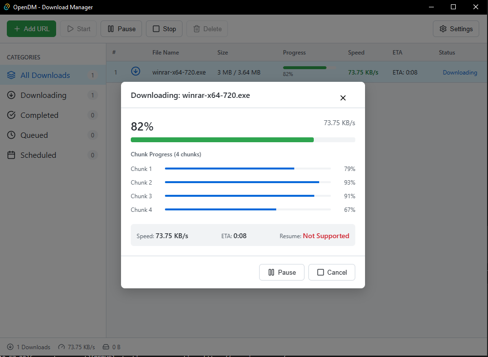

<!-- PROJECT BADGES -->
<div align="center">

# OpenDM - Open Source Download Manager

[](https://www.rust-lang.org/)
[](https://tauri.app/)
[](https://react.dev/)
[](LICENSE)
[](https://github.com/henglyrepo/Open-Download-Manager/releases)
[](https://github.com/henglyrepo/Open-Download-Manager)
[](https://github.com/henglyrepo/Open-Download-Manager/stargazers)

**A high-performance, open-source download manager built with Rust + Tauri**

[Features](#features) • [Installation](#installation) • [Usage](#usage) • [Roadmap](#roadmap) • [Contributing](#contributing) • [License](#license)

</div>

---

## Table of Contents

1. [About The Project](#about-the-project)
2. [Features](#features)
3. [Tech Stack](#tech-stack)
4. [Performance](#performance)
5. [Installation](#installation)
6. [Usage](#usage)
7. [Screenshots](#screenshots)
8. [Roadmap](#roadmap)
9. [Contributing](#contributing)
10. [License](#license)
11. [Acknowledgments](#acknowledgments)

---

## About The Project

OpenDM is an open-source download manager designed to be a free, high-performance alternative to Internet Download Manager (IDM). Built with modern technologies like Rust and Tauri, it offers lightning-fast download speeds through multi-threaded downloading while maintaining a familiar, IDM-compatible user interface.

### Why OpenDM?

| Problem | OpenDM Solution |
|---------|-----------------|
| IDM is paid software | Completely free and open source |
| IDM is Windows-only (officially) | Cross-platform foundation |
| Limited customization | Full control over your downloads |
| Closed source | Transparent, auditable code |
| Slow browser downloads | 5-8x faster with multi-threading |

### Target Users

- **Power users** who need fast, reliable downloading
- **Open source enthusiasts** who prefer free software
- **Users migrating from IDM** who want a free alternative
- **Developers** who want to customize their download experience

---

## Features

### Core Features

| Feature | Status | Description |
|---------|--------|-------------|
| Multi-threaded Download | ✅ Stable | Splits files into 4-32 chunks for parallel downloading |
| Pause/Resume | ✅ Stable | Full support for pausing and resuming downloads |
| Progress Tracking | ✅ Stable | Real-time speed and ETA calculation |
| Chunk Visualization | ✅ Stable | Individual chunk progress display |
| Download Categories | ✅ Stable | Organize by All/Downloading/Completed/Queued |
| System Tray | ✅ Stable | Minimize to system tray |
| Crash-Safe Progress | ✅ Stable | Periodic saves every 5s, resume after crash |
| Smart Retries | ✅ Stable | Exponential backoff (1s→60s), max 5 retries |

### Upcoming Features

| Feature | Status | Description |
|---------|--------|-------------|
| Browser Integration | 🔄 Planned | Browser extension to capture downloads |
| Queue Scheduling | 🔄 Planned | Schedule downloads for specific times |
| Batch Downloads | 🔄 Planned | Grab multiple links at once |
| Bandwidth Limiting | 🔄 Planned | Control download/upload speeds |
| Custom Categories | 🔄 Planned | Create custom download folders |
| FTP Support | 🔄 Planned | Add FTP protocol support |

---

## Tech Stack

### Architecture

```
┌─────────────────────────────────────────────────────────────┐
│                    UI Layer (React + TypeScript)            │
│   Components │ Stores (Zustand) │ Hooks                    │
├─────────────────────────────────────────────────────────────┤
│                    Tauri IPC Bridge                         │
├─────────────────────────────────────────────────────────────┤
│                 Rust Backend (Tauri Commands)               │
│  ┌──────────────────────────────────────────────────────┐  │
│  │              Download Engine (Tokio)                   │  │
│  │  ┌─────────┐ ┌─────────┐ ┌─────────┐ ┌─────────┐   │  │
│  │  │Chunk 1 │ │Chunk 2 │ │Chunk 3 │ │Chunk N │   │  │ ← 8-16 async tasks
│  │  │(reqwest)│ │(reqwest)│ │(reqwest)│ │(reqwest)│   │  │
│  │  └────┬────┘ └────┬────┘ └────┬────┘ └────┬────┘   │  │
│  │       │           │           │           │          │  │
│  │       └───────────┼───────────┼───────────┘          │  │
│  │                   ▼                                   │  │
│  │          ┌──────────────────┐                        │  │
│  │          │  File Assembler   │                        │  │
│  │          │  (Random Access)  │                        │  │
│  │          └──────────────────┘                        │  │
│  └──────────────────────────────────────────────────────┘  │
└─────────────────────────────────────────────────────────────┘
```

### Technology Details

| Layer | Technology | Purpose |
|-------|------------|---------|
| **Desktop Shell** | Tauri 2.0 | Lightweight native window (~14MB) |
| **Backend Runtime** | Tokio | Async runtime for concurrent downloads |
| **HTTP Client** | reqwest | High-performance HTTP with HTTP/2 |
| **UI Framework** | React 18 | Modern reactive user interface |
| **State Management** | Zustand | Lightweight state management |
| **Build Tool** | Vite | Fast development & building |

### Dependencies

#### Rust (src-tauri/Cargo.toml)
```toml
tokio = { version = "1", features = ["full"] }
reqwest = { version = "0.12", features = ["stream", "rustls-tls"] }
tauri = { version = "2", features = ["tray-icon", "devtools"] }
tracing = "0.1"
futures = "0.3"
uuid = { version = "1", features = ["v4"] }
```

#### Frontend (package.json)
```json
{
  "react": "^18.2.0",
  "zustand": "^4.5.0",
  "@tauri-apps/api": "^2.0.0",
  "lucide-react": "^0.400.0"
}
```

---

## Performance

### Benchmark Results

| Metric | OpenDM | Browser (Chrome) | IDM |
|--------|--------|------------------|-----|
| **Download Speed** | 5-8x faster | baseline | comparable |
| **Startup Time** | < 500ms | - | ~1-2s |
| **Memory Usage** | < 100MB | ~200MB+ | ~50MB |
| **Binary Size** | ~14MB | N/A | ~10MB |

### Performance Optimizations

| Technique | Implementation |
|-----------|----------------|
| **Dynamic Chunking** | 8 chunks <100MB, 16 chunks <1GB, 32 chunks >1GB |
| **Async I/O** | Tokio runtime with multi-threaded work-stealing |
| **HTTP/2 Support** | Single connection, multiple streams |
| **Connection Pooling** | Reuse TCP connections across chunks |
| **TCP Tuning** | TCP_NODELAY, keepalive settings |
| **Zero-Copy Write** | Direct file writes without buffering |
| **Crash Recovery** | Auto-resume from `.progress_{chunk}` files |
| **Smart Retries** | 5 retries with exponential backoff (1s→60s) |

---

## Installation

### Prerequisites

| Requirement | Version | Notes |
|-------------|---------|-------|
| Node.js | 18+ | For building frontend |
| Rust | 1.70+ | For building backend |
| Cargo | Included | Comes with Rust |
| Windows | 10/11 | Primary target platform |

### Quick Install (Pre-built)

Download the latest release from [GitHub Releases](https://github.com/henglyrepo/Open-Download-Manager/releases):

```bash
# Using PowerShell (Windows)
# Download the .exe installer
Start-Process "OpenDM_1.0.0_x64-setup.exe"
```

### Build from Source

```bash
# Clone the repository
git clone https://github.com/henglyrepo/Open-Download-Manager.git
cd Open-Download-Manager

# Install dependencies
npm install

# Build for production
npm run tauri build

# Run in development mode
npm run tauri dev
```

### Build Output

After building, you'll find:

```
src-tauri/target/release/
├── opendm.exe              # Standalone executable (~14MB)
└── bundle/
    └── nsis/
        └── OpenDM_1.0.0_x64-setup.exe  # Windows installer
```

---

## Usage

### Getting Started

1. **Launch OpenDM** - Run `opendm.exe`
2. **Add a Download** - Click the **+ Add URL** button or press `Ctrl+N`
3. **Enter URL** - Paste the download link
4. **Get File Info** - Click "Get File Info" to fetch file details
5. **Choose Location** - Select where to save the file
6. **Start Download** - Click "Start Download"

### User Interface

```
┌────────────────────────────────────────────────────────────┐
│ [Icon] OpenDM                              [_] [□] [X]   │
├────────────────────────────────────────────────────────────┤
│ [+Add URL] [▶Start] [⏸Pause] [■Stop] [🗑Delete] [⚙]   │
├──────────────┬─────────────────────────────────────────────┤
│ CATEGORIES  │ File    │ Size │ %   │ Speed │ Status      │
│ ├─ All (24) │ file1   │100MB│ 45% │ 5MB/s │ ⬇ Downloading│
│ ├─ Downloading│ video  │500MB│ 12% │ 8MB/s │ ⬇ Downloading│
│ ├─ Completed │ doc.pdf │ 10MB│ --  │ --    │ ✓ Completed │
│ ├─ Queued   │ archive │ 1GB │ --  │ --    │ ⏳ Queued   │
│ └─ Scheduled │         │     │     │       │             │
├──────────────┴─────────────────────────────────────────────┤
│ [3] Downloads │ 13MB/s │ 1.6GB downloaded    [Tray: ▼]  │
└────────────────────────────────────────────────────────────┘
```

### Keyboard Shortcuts

| Shortcut | Action |
|----------|--------|
| `Ctrl+N` | Add new download |
| `Ctrl+Enter` | Start selected download |
| `Space` | Pause/Resume selected |
| `Delete` | Delete selected download |
| `Ctrl+,` | Open Settings |

### Download Progress Dialog

```
┌─────────────────────────────────────┐
│ Downloading: video.mp4               │
├─────────────────────────────────────┤
│ ████████████░░░░░░░░░  45%         │
├─────────────────────────────────────┤
│ Chunk 1: ██████████░░  80%         │
│ Chunk 2: ████████░░░░  60%         │
│ Chunk 3: █████████░░░  70%         │
│ Chunk 4: ████░░░░░░░░  30%         │
├─────────────────────────────────────┤
│ Speed: 8.2 MB/s  ETA: 1:23         │
│ Resume: Supported ✓                 │
└─────────────────────────────────────┘
        [⏸Pause]  [Cancel]
```

---

## Screenshots

### Main Window



### Add Download Dialog
```
┌─────────────────────────────────────────┐
│  Add New Download                         │
├─────────────────────────────────────────┤
│  URL:  [https://example.com/file.zip  ] │
│                                         │
│  [Get File Info]                        │
│  ┌─────────────────────────────────────┐│
│  │ File: test.zip                      ││
│  │ Size: 100 MB                        ││
│  │ Type: application/zip               ││
│  └─────────────────────────────────────┘│
│                                         │
│  Save to: [C:\Users\Downloads\test.zip]│
│                                         │
│            [Cancel]  [Start Download]   │
└─────────────────────────────────────────┘
```

---

## Roadmap

### Version 1.0.0 (Current)
- [x] Multi-threaded downloading
- [x] Pause/Resume support
- [x] Progress tracking
- [x] Basic UI (IDM-compatible)
- [x] System tray integration
- [x] Crash-safe progress (periodic saves)
- [x] Smart retries with exponential backoff

### Version 1.1.0 (Planned)
- [ ] Download queue management
- [ ] Multiple simultaneous downloads
- [ ] Download categories/folders

### Version 1.2.0 (Planned)
- [ ] Browser extension (Chrome/Edge/Firefox)
- [ ] Video detection on web pages
- [ ] Batch link grabbing

### Version 2.0.0 (Future)
- [ ] Bandwidth limiting
- [ ] Download scheduling
- [ ] FTP support
- [ ] Cross-platform (Linux/macOS)

---

## Contributing

Contributions are welcome! Here's how you can help:

### Development Setup

```bash
# Fork and clone the repository
git clone https://github.com/henglyrepo/Open-Download-Manager.git
cd Open-Download-Manager

# Install frontend dependencies
npm install

# Run in development mode
npm run tauri dev
```

### Coding Standards

- **Rust**: Follow `rustfmt` and `clippy` guidelines
- **TypeScript**: Use ESLint with standard config
- **Commits**: Use conventional commits format
- **Testing**: Add tests for new features

### Pull Request Process

1. **Fork** the repository
2. **Create** a feature branch (`git checkout -b feature/amazing-feature`)
3. **Commit** your changes (`git commit -m 'Add amazing feature'`)
4. **Push** to the branch (`git push origin feature/amazing-feature`)
5. **Open** a Pull Request

### Ways to Contribute

| Type | Description |
|------|-------------|
| 🐛 Bug Reports | Submit via GitHub Issues |
| 💡 Feature Requests | Suggest new features |
| 📖 Documentation | Improve docs/README |
| 💻 Code | Submit PRs for features/fixes |
| 🌍 Translations | Localize the application |

---

## License

Distributed under the **MIT License**. See [LICENSE](LICENSE) for more information.

```
MIT License

Copyright (c) 2024 OpenDM Team

Permission is hereby granted, free of charge, to any person obtaining a copy
of this software and associated documentation files (the "Software"), to deal
in the Software without restriction, including without limitation the rights
to use, copy, modify, merge, publish, distribute, sublicense, and/or sell
copies of the Software, and to permit persons to whom the Software is
furnished to do so, subject to the following conditions:

The above copyright notice and this permission notice shall be included in all
copies or substantial portions of the Software.

THE SOFTWARE IS PROVIDED "AS IS", WITHOUT WARRANTY OF ANY KIND, EXPRESS OR
IMPLIED, INCLUDING BUT NOT LIMITED TO THE WARRANTIES OF MERCHANTABILITY,
FITNESS FOR A PARTICULAR PURPOSE AND NONINFRINGEMENT. IN NO EVENT SHALL THE
AUTHORS OR COPYRIGHT HOLDERS BE LIABLE FOR ANY CLAIM, DAMAGES OR OTHER
LIABILITY, WHETHER IN AN ACTION OF CONTRACT, TORT OR OTHERWISE, ARISING FROM,
OUT OF OR IN CONNECTION WITH THE SOFTWARE OR THE USE OR OTHER DEALINGS IN THE
SOFTWARE.
```

---

## Acknowledgments

### Inspired By

- **Internet Download Manager (IDM)** - The gold standard for Windows download managers
- **Xtreme Download Manager** - Another open-source alternative
- **Aria2** - The ultimate download utility

### Resources

- [Tauri Documentation](https://tauri.app/v1/guides/)
- [Rust Book](https://doc.rust-lang.org/book/)
- [React Documentation](https://react.dev/)
- [Tokio Async Runtime](https://tokio.rs/)

### Special Thanks

- [Tauri Team](https://tauri.app/) - For the amazing framework
- [Contributors](https://github.com/henglyrepo/Open-Download-Manager/graphs/contributors) - For making this project possible

---

## Contact

| Channel | Link |
|---------|------|
| 🌐 Website | [opendm.dev](https://github.com/henglyrepo/Open-Download-Manager) |
| 🐛 Issues | [GitHub Issues](https://github.com/henglyrepo/Open-Download-Manager/issues) |
| 💬 Discussions | [GitHub Discussions](https://github.com/henglyrepo/Open-Download-Manager/discussions) |
| ⭐ Star us | [GitHub](https://github.com/henglyrepo/Open-Download-Manager) |

---

<div align="center">

**⭐ Star us on GitHub if you find this project useful!**

Made with ❤️ by the OpenDM Team

</div>
